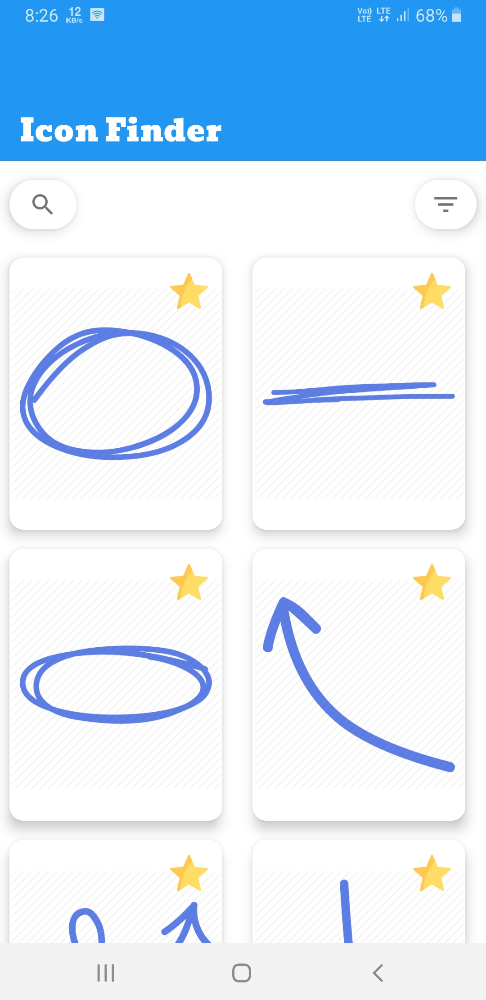
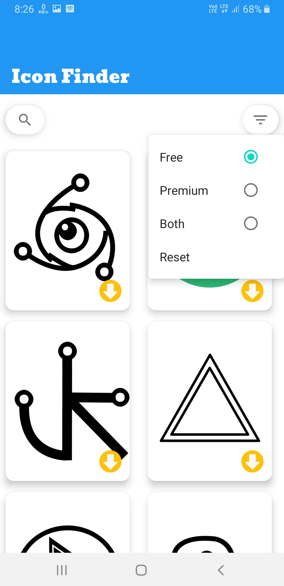
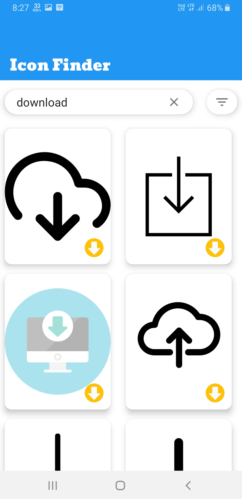

##  Project Overview
IconFinder App use IconFinder API to fetch icons of specific category. User can search icons and download free icons with different resolution. This project is build using MVVM architecture. __Retrofit2__ is used to make async network calls and __Okhttp3__ is used to implement interceptor to debug network calls.

| -------------- | -------------- |
|    |    |
|  |  |

### Instructions
To install this project clone the repository and add your IconFiner API in file `app/src/main/java/coding/universe/iconfinder/network/ApiClient.kt`  
to variable __API_KEY__
